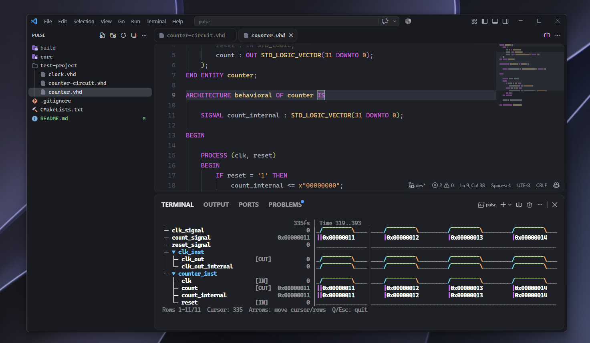
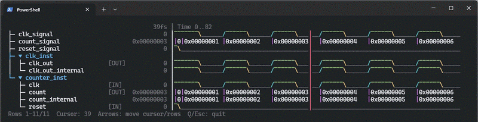
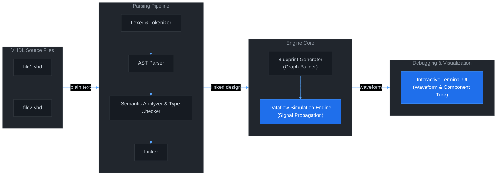
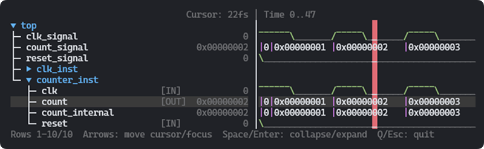

# Pulse

[](https://en.cppreference.com/w/cpp/20) [](https://opensource.org/licenses/MIT) [](https://cmake.org/) 

_Pulse_ is a multi-platform digital logic simulation engine for VHDL made with C++. It transforms VHDL source code into a logic components simulation model that can be simulated and debugged.

It features a complete VHDL compilation pipeline, including a lexer, AST parser, semantic analyzer, and a multi-file AST linker to resolve complex module hierarchies. The resulting design is built using a high-efficiency dataflow simulation engine that supports multi-valued IEEE 1164 logic states and asynchronous processes.

As a result, the obtained waveform is displayed in an interactive terminal-based UI, allowing users to navigate through the simulation results and inspect signal values at different time steps.



## Installation

### Prerequisites

You will need the following tools installed on your system to build Pulse:

- **C++20 Compiler**
- **CMake** (v3.14 or higher)

### Build Instructions

Start by cloning the repository and navigating into the project directory:

```bash
git clone https://github.com/oscar30gt/pulse.git
cd pulse
```

## Configure and build

Once inside the project directory, run cmake to configure the build system and then build the project:

```bash
cmake -B build
cmake --build build --config Release
```

> Resulting binaries will be located in `build/Debug` or `build/Release` depending on the build type.

## Usage

The pulse binary can be executed from the command line, providing the VHDL project folder as an argument:

```bash
./build/Release/pulse test-project
```

The following command line options are available:

| Option              | Description                                             |
| ------------------- | ------------------------------------------------------- |
| `-h`, `--help`      | Show help message and exit                              |
| `-v`, `--version`   | Show version information and exit                       |
| `-R`, `--recursive` | Recursively search for VHDL files in subdirectories     |
| `--top <entity>`    | Specify the top-level entity to simulate (default: top) |
| `--end <time>`      | Specify the simulation end time (default: 1000fs)        |
| `--arch <arch>`     | Specify the architecture to build (default: behavioral) |

**Examples:**

```bash
# Run simulation on a project folder (defaults to top-level entity "top")
$ pulse ./examples/counter

# Specify top-level entity, simulation architecture, and end time
$ pulse ./examples/counter --top CounterTop --arch Behavioral --end 2000fs

# Search for VHDL sources recursively
$ pulse ./examples/my_project -R
```

### TUI Controls


| Key | Action |
| --- | --- |
| **Left / Right** | Move time cursor back and forth |
| **Up / Down** | Move focus up and down |
| **Space / Enter** | Collapse/expand a node |
| **Q / Esc** | Exit interactive debugger |

## Supported Syntax

VHDL language is too large. Here is a list of the supported syntax in Pulse:

- **Libraries:** For compatibility with other VHDL simulators, Pulse will not give compiler errors when using libraries. However, library declarations will be ignored.

- **Signal types:** IEEE 1164 logic types are supported natively, including `std_logic` and `std_logic_vector`. `to` and `downto` can be used for vector ranges.

- **Architectures:** Architectures can include component declarations, signal declarations, processes, combinational statements and component instantiations.

- **Signal declarations:** Same as ports. Valid types are `std_logic` and `std_logic_vector` and no default values are supported for now.

- **Signal assignments:** Assignments using the `<=` operator. Assignments can be done with only a bit or range of the target signal being assigned.

- **Processes:** Processes with sensitivity lists and wait statements. Conditional statements using `if`, `elsif`, and `else` are supported. Allowed wait statements are `WAIT FOR <time>`, `WAIT` (forever). Loops and case statements to come in the future.

- **Component instantiations:** Component instantiations with port mappings. Port mappings are done by name. Positional port mapping is not supported.

- **Functions**: `signed()` and `unsigned()` type conversion functions are supported for comparisons and arithmetic operations.

- **Operators:** Logic: `and`, `or`, `not`, `xor`, `nand`, `nor`, `xnor`; Shifts: `sll`, `srl`, `sra`, `rol`, `ror`; Arithmetic: `+`, `-`, `*`; Comparison: `=`, `/=`, `<`, `>`, `<=`, `>=`; Concatenation: `&`.

- **Time units:** Units from femtoseconds to seconds. Valid time units are `fs`, `ps`, `ns`, `us`, `ms`, and `s`. Time values can be specified as integers or floating-point numbers.

- **Comments:** Single-line comments using `--`.

- **File extensions:** When searching for VHDL files, files with the following extensions will be considered: `.vhd`, `.vhdl`.

> More features will be added in the future, including support for generics, sequential logic, and more complex VHDL constructs.

## Compilation Pipeline

The compilation pipeline of Pulse consists of the following stages:



- **Parsing Pipeline:** Responsible for parsing and analyzing the VHDL source code, generating an intermediate representation of the design.

- **Engine Core:** Takes the intermediate representation and builds an object called a **"blueprint"** for every component in the design. The blueprint describes the physical circuit (graph made of gates, comparators, wires...) that implements the VHDL design. The blueprint will be used to instantiate a functional version of the design.

- **Debugging & Visualization:** A simulated circuit outputs a **waveform**, which represents how signals change over time. That waveform is displayed in an interactive terminal-based UI where values can be inspected at different time steps.



## Roadmap

Pulse will continue to evolve and improve over time. Here are some of the planned features and improvements:
- Extended support for VHDL constructs, including generics, types and more complex logic.
- Enhanced simulation engine with better performance and support for larger designs.
- Improved TUI with more interactive features and better visualization options.
- An optional web-based GUI for waveform visualization using a modern web framework such as React.
- Verilog support and, eventually, mixed-language (VHDL + Verilog) simulation capabilities.

## License

[MIT](LICENSE)
