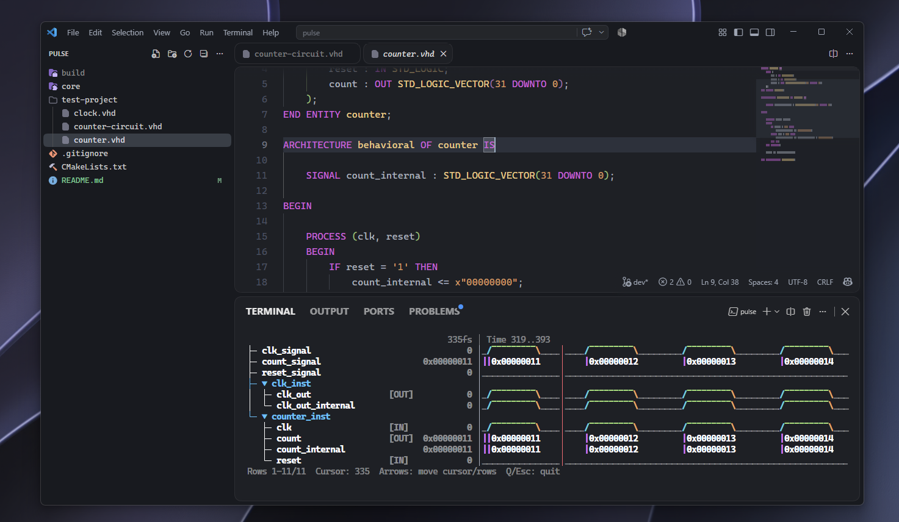
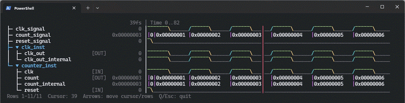
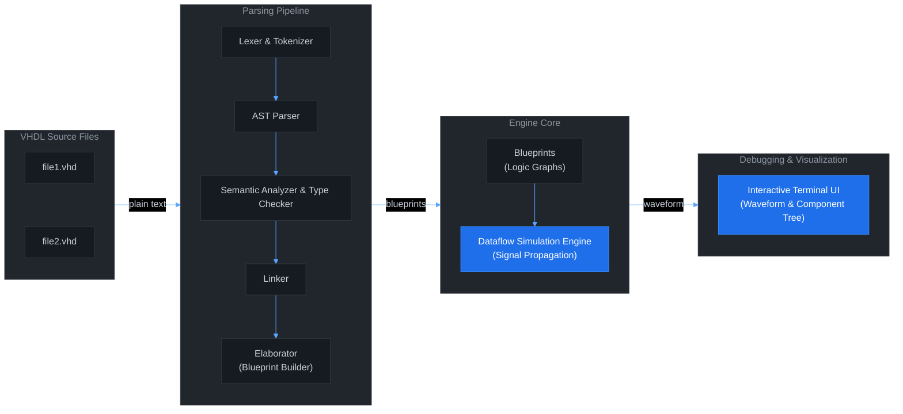
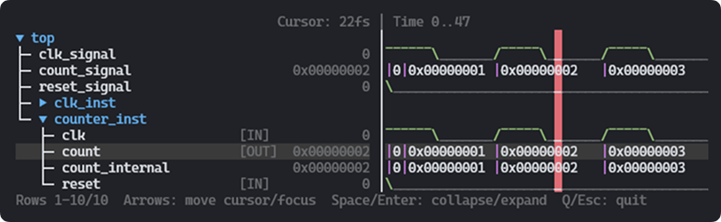

# Pulse

[](https://en.cppreference.com/w/cpp/20) [](https://opensource.org/licenses/MIT) [](https://cmake.org/)

_Pulse_ is a multi-platform digital logic simulation engine for VHDL made with C++. It transforms VHDL source code into a logic components simulation model that can be simulated and debugged.

It features a complete VHDL compilation pipeline, including a lexer, AST parser, semantic analyzer, a multi-file AST linker to resolve complex module hierarchies, and an elaborator that lowers the design to logic components. The resulting design is built using a high-efficiency dataflow simulation engine that supports multi-valued IEEE 1164 logic states and asynchronous processes.

As a result, the obtained waveform is displayed in an interactive terminal-based UI, allowing users to navigate through the simulation results and inspect signal values at different time steps.



## Installation

### Prerequisites

You will need the following tools installed on your system to build Pulse:

- **C++20 Compiler**
- **CMake** (v3.14 or higher)

### Build Instructions

Start by cloning the repository and navigating into the project directory:

```bash
git clone https://github.com/oscar30gt/pulse.git
cd pulse
```

## Configure and build

Once inside the project directory, run cmake to configure the build system and then build the project:

```bash
cmake -B build
cmake --build build
```

> Resulting binaries will be located in `build/bin`.

## Usage

The pulse binary can be executed from the command line, providing the VHDL project folder as an argument:

```bash
./build/bin/pulse test-project
```

The following command line options are available:

| Option              | Description                                             |
| ------------------- | ------------------------------------------------------- |
| `-h`, `--help`      | Show help message and exit                              |
| `-v`, `--version`   | Show version information and exit                       |
| `-R`, `--recursive` | Recursively search for VHDL files in subdirectories     |
| `--top <entity>`    | Specify the top-level entity to simulate (default: top) |
| `--end <time>`      | Specify the simulation end time (default: 1000fs)        |
| `--arch <arch>`     | Specify the architecture of the top-level entity (default: its most recently analyzed one) |
| `-Ologic`           | Simulate `std_logic` as four-valued logic: `'0'`/`'L'` are 0, `'1'`/`'H'` are 1, `'Z'` is Z, and `'U'`/`'X'`/`'W'`/`'-'` are X. It is the only mode supported for now, so it is always on. |

Every other entity uses its most recently analyzed architecture, the default binding of the LRM (7.3.3).

**Examples:**

```bash
# Run simulation on a project folder (defaults to top-level entity "top")
$ pulse ./examples/counter

# Specify top-level entity, simulation architecture, and end time
$ pulse ./examples/counter --top CounterTop --arch Behavioral --end 2000fs

# Search for VHDL sources recursively
$ pulse ./examples/my_project -R
```

> [!NOTE]
> This examples assume that the `pulse` binary is in your current path. Plus, no examples folder is provided in this repository. This is just an usage example.

### TUI Controls


| Key | Action |
| --- | --- |
| **Left / Right** | Move time cursor back and forth |
| **Up / Down** | Move focus up and down |
| **Space / Enter** | Collapse/expand a component, or a logic vector into its bits |
| **Q / Esc** | Exit interactive debugger |

## Supported Syntax

VHDL is a huge language, so Pulse supports a defined subset of VHDL-2008. The tokenizer and the parser check the syntax of that subset, and **everything the parser accepts is analyzed** (types, scopes, drivers, subprogram rules) and reported with a located error message when it is wrong. Anything outside the subset, such as packages, configurations, `generate` and `block` statements or access and file types, is a syntax error. What Pulse supports:

- **Design units:** entities and architectures. `library` and `use` clauses are accepted and ignored, so designs written for other simulators still compile. A design can span several files: each file is analyzed into the `work` library after the files that declare the entities it needs, so an architecture may live in another file than its entity (within one file, an entity comes before its architectures, as in any VHDL tool). When the design is linked, every component instance is bound to the entity of the same name, whose generics and ports must match the component's.

- **Types:** enumerations (including character literals), integer, real and physical (`units`) types, constrained and unconstrained arrays (also multi-dimensional ones, with the limits below), records, and subtypes with range constraints, index constraints and resolution indications. Predefined: `boolean`, `integer`, `natural`, `positive`, `real`, `time`, `severity_level`, `std_logic`, `std_logic_vector`, `unsigned` and `signed`. Declare `character` and `string` yourself when a `report` or `assert` needs a message.

- **Objects:** signals, constants, variables and aliases (of objects, slices, types, subprograms and operators). Entities and components have generics and generic maps, and ports with default values. Bounds that depend on a generic are not checked until the design is instantiated.

- **Attributes:** the predefined `'event`, `'length`, `'left`, `'right`, `'high`, `'low`, `'range` and `'reverse_range`, plus your own (`attribute a : t; attribute a of x : signal is v;`). As the LRM requires, an architecture's own attributes are specified in its declarative part.

- **Subprograms:** pure and impure functions and procedures with `constant`, `signal` and `variable` parameters and default values; overloading, operator overloading (`function "+"(...)`), named, positional and partial associations, and conversion functions on formals. The rules of the LRM are checked: purity, no `wait` in functions, a `return` on every path of a function, and no `wait` in a procedure called from a process with a sensitivity list.

- **Concurrent statements:** processes (with a sensitivity list, `all` or `wait` statements), simple, conditional (`when ... else`) and selected (`with ... select`, `select?`) signal assignments, aggregate targets, `assert`, procedure calls and component instantiations with named or positional port and generic maps.

- **Sequential statements:** signal and variable assignments, `if`, `case` and `case?`, `for`, `while` and plain `loop` with `next` and `exit`, `wait`, `return`, `null`, `assert` and `report`.

- **Expressions:** every VHDL operator (logic, relational, shifts, adding, multiplying, `**`, `abs`, `not`), the VHDL-2008 matching operators (`?=`, `?<`, ...), the condition operator `??`, logical reductions, qualified expressions, type conversions, aggregates and external names. Constants are folded, so ranges, lengths and static values are checked at analysis time.

- **Multi-driver rule:** signals of a resolved type (`std_logic` and arrays of it) may have several drivers; any other type may not.

- **Time units:** `fs`, `ps`, `ns`, `us`, `ms`, `sec`, `min` and `hr`, written as integers or floating-point numbers.

- **Comments:** `--` line comments and `/* */` block comments.

- **File extensions:** When searching for VHDL files, files with the following extensions will be considered: `.vhd`, `.vhdl`.

- **IEEE packages:** the operators and functions of `std_logic_1164` and `numeric_std` are predeclared, as signatures without a body: logical operators, shifts and reductions on `std_logic`, `std_logic_vector`, `unsigned` and `signed`; `numeric_std` arithmetic and comparisons, whose result lengths follow the package (`+` gives the longer operand, `*` the sum of the lengths ...); and `rising_edge`, `falling_edge`, `to_integer`, `to_unsigned`, `to_signed`, `resize`, `shift_left`, `shift_right`, `rotate_left` and `rotate_right`.

Known limits: aggregates and slices of multi-dimensional arrays, `entity work.e` direct instantiation, and the `bit` and `bit_vector` types are not supported. Expressions with more than 2000 chained operators, or nested more than 250 levels, are refused with an error.

### Simulation

Everything above is analyzed, but only part of it can be simulated yet. The elaborator turns the design into logic components (gates, adders, comparators, shifters, processes and nested subgraphs), and reports anything else as "not supported yet":

- **Types:** `std_logic`, `boolean`, enumerations (binary-encoded), integer types (as wide as their base type: `integer` and its subtypes are 32-bit two's complement) and one-dimensional arrays of `std_logic` (`std_logic_vector`, `unsigned`, `signed`) of at most 64 elements. Records, other arrays, and signals of real or physical types (time) are not supported; constants of those types are, where their value is folded (`wait for PERIOD`).
- **Generics:** like C++ templates: every distinct set of generic values gets its own blueprint, and generic values must be known at elaboration time. The generics of the top entity take their default values.
- **Concurrent statements:** simple, conditional and selected signal assignments (a conditional assignment without a final `else` keeps its value, like the process it stands for), processes and component instances.
- **Processes:** sensitivity lists and `process(all)`, variables, `if`, `case` and `case?`, `for` loops with a static range (unrolled, with `exit` and `next`), `wait`, `wait for`, `wait on` and `wait until` with static times. Signal assignments take effect once every process has run, as in VHDL.
- **Expressions:** every IEEE operator above, the predefined operators of integers, enumerations and vectors, `'event`, static slices and indexes, aggregates, type conversions between vectors and between integers, and values computed at elaboration time (generics, constants, attributes such as `'length`).
- **Not supported yet:** subprograms declared in the design, aliases, `while` and plain loops, `assert` and `report`, indexes and slices that are not known at elaboration time, `/`, `mod`, `rem` and `**` on values that are not known at elaboration time, `sla`, external names, partial port associations and conversions in port maps, and a signal assigned in a process that has any other driver.

## Compilation Pipeline

The compilation pipeline of Pulse consists of the following stages:


```mermaid
%%{init: {'theme': 'base', 'themeVariables': { 'darkMode': true, 'background': '#0d1117', 'primaryColor': '#161b22', 'primaryTextColor': '#c9d1d9', 'primaryBorderColor': '#30363d', 'lineColor': '#58a6ff', 'tertiaryColor': '#21262d', 'tertiaryBorderColor': '#30363d', 'tertiaryTextColor': '#8b949e'}}}%%
flowchart LR
    subgraph Input ["VHDL Source Files"]
        direction TB
        V1["file1.vhd"]
        V2["file2.vhd"]
        V1 ~~~ V2
    end

    subgraph Parser ["Parsing Pipeline"]
        direction TB
        Lexer["Lexer & Tokenizer"] --> AST["AST Parser"]
        AST --> Semantics["Semantic Analyzer & Type Checker"]
        Semantics --> Linker["Linker"]
        Linker --> Elaborator["Elaborator\n(Blueprint Builder)"]
    end

    subgraph Core ["Engine Core"]
        direction TB
        Blueprint["Blueprints\n(Logic Graphs)"] --> Dataflow["Dataflow Simulation Engine\n(Signal Propagation)"]
    end

    subgraph Output ["Debugging & Visualization"]
        direction TB
        TUI["Interactive Terminal UI\n(Waveform & Component Tree)"]
    end

    Input --plain text--> Parser
    Parser --blueprints--> Core
    Core --waveform--> Output

    classDef default fill:#161b22,stroke:#30363d,color:#c9d1d9
    classDef highlight fill:#1f6feb,stroke:#388bfd,color:#ffffff
    class TUI,Dataflow highlight
```

- **Parsing Pipeline:** Responsible for parsing, analyzing and linking the VHDL source code. The elaborator then starts at the top entity and builds an object called a **"blueprint"** for every entity of the design (one per set of generic values). The blueprint describes the physical circuit (graph made of gates, comparators, wires...) that implements the VHDL design.

- **Engine Core:** Instantiates a functional version of the design from the blueprints and simulates it one tick (one femtosecond, and one VHDL delta cycle) at a time: every wire publishes its `'event`, every component runs, and the processes commit their signal assignments.

- **Debugging & Visualization:** A simulated circuit outputs a **waveform**, which represents how signals change over time. That waveform is displayed in an interactive terminal-based UI where values can be inspected at different time steps. Each blueprint carries a symbol table, so every signal is shown as its VHDL type says: logic vectors in hexadecimal (and expandable into their bits), integers in decimal, enumerations by literal and booleans as true/false.



## Roadmap

Pulse will continue to evolve and improve over time. Here are some of the planned features and improvements:
- Extended support for VHDL constructs, including generics, types and more complex logic.
- Enhanced simulation engine with better performance and support for larger designs.
- Improved TUI with more interactive features and better visualization options.
- An optional web-based GUI for waveform visualization using a modern web framework such as React.
- Verilog support.

## License

[MIT](LICENSE)