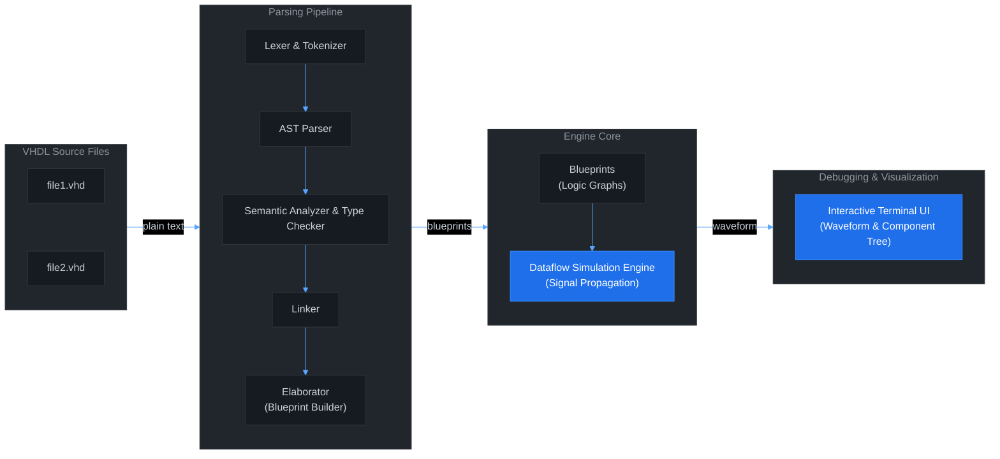

# Pulse

[](https://en.cppreference.com/w/cpp/20) [](https://opensource.org/licenses/MIT) [](https://cmake.org/)

_Pulse_ is a multi-platform digital logic simulation engine for VHDL made with C++. It transforms VHDL source code into a logic components simulation model that can be simulated and debugged.

It features a complete VHDL compilation pipeline, including a lexer, AST parser, semantic analyzer, a multi-file AST linker to resolve complex module hierarchies, and an elaborator that lowers the design to logic components. The resulting design is built using a high-efficiency dataflow simulation engine that supports four-valued (`0`, `1`, `X`, `Z`) logic, resolved signals and asynchronous processes.

As a result, the obtained waveform is displayed in an interactive terminal-based UI, allowing users to navigate through the simulation results and inspect signal values at different time steps.


## Installation

### Prerequisites

You will need the following tools installed on your system to build Pulse:

- **C++20 Compiler**
- **CMake** (v3.14 or higher)

### Build Instructions

Start by cloning the repository and navigating into the project directory:

```bash
git clone https://github.com/oscar30gt/pulse.git
cd pulse
```

### Configure and build

Once inside the project directory, run cmake to configure the build system and then build the project:

```bash
cmake -B build
cmake --build build
```

> Resulting binaries will be located in `build/bin`.

## Usage

The pulse binary can be executed from the command line, providing the VHDL project folder as an argument:

```bash
./build/bin/pulse test-project
```

The following command line options are available, before or after the project folder:

| Option              | Description                                             |
| ------------------- | ------------------------------------------------------- |
| `-h`, `--help`      | Show help message and exit                              |
| `-v`, `--version`   | Show version information and exit                       |
| `-R`, `--recursive` | Recursively search for VHDL files in subdirectories     |
| `--top <entity>`    | Specify the top-level entity to simulate (default: top) |
| `--end <time>`      | Specify the simulation end time: an integer followed by `fs`, `ps`, `ns`, `us`, `ms` or `s`, femtoseconds when there is no unit (default: 1000fs) |
| `--arch <arch>`     | Specify the architecture of the top-level entity (default: its most recently analyzed one) |
| `-Ologic`           | Simulate `std_logic` as four-valued logic: `'0'`/`'L'` are 0, `'1'`/`'H'` are 1, `'Z'` is Z, and `'U'`/`'X'`/`'W'`/`'-'` are X. It is the only mode supported for now, so it is always on. |

Every other entity uses its most recently analyzed architecture, the default binding of the LRM (7.3.3).

**Examples:**

```bash
# Run simulation on a project folder (defaults to top-level entity "top")
$ pulse ./examples/counter

# Specify top-level entity, simulation architecture, and end time
$ pulse ./examples/counter --top CounterTop --arch Behavioral --end 2000fs

# Search for VHDL sources recursively
$ pulse ./examples/my_project -R
```

> [!NOTE]
> These examples assume that the `pulse` binary is in your current path. Plus, no examples folder is provided in this repository. This is just a usage example.

### Error Messages

Pulse stops at the first error in the design and reports it the way GCC and Clang do: the file, line and column, the stage of the compiler that found it (`lexical`, `syntax`, `semantic`, `link` or `elaboration`), and the source line with a caret under the column. The output is colored when it goes to a terminal; set `NO_COLOR` to turn colors off.

```text
test-project/counter.vhd:30:5: elaboration error: The assert statement is not supported yet
   30 |     ASSERT count_internal /= 0;
      |     ^
```

Errors about the design as a whole have no location:

```text
elaboration error: Top-level entity 'cpu' not found in the design; give the name of the top entity (--top)
```

### TUI Controls


| Key | Action |
| --- | --- |
| **Left / Right** | Move time cursor back and forth |
| **Up / Down** | Move focus up and down |
| **Space / Enter** | Collapse/expand a component, or a logic vector into its bits |
| **Q / Esc** | Exit interactive debugger |

## Supported Syntax

VHDL is a huge language, so Pulse supports a defined subset of VHDL-2008. The tokenizer and the parser check the syntax of that subset, and **everything the parser accepts is analyzed** (types, scopes, drivers, subprogram rules) and reported with a located error message when it is wrong. Anything outside the subset is a syntax error, in particular:

- packages, `context` clauses and configurations;
- `generate` and `block` statements, `postponed` processes and guarded signals;
- delays and waveforms in signal assignments (`after`, `transport`, `inertial`, `reject`), and `force` / `release`;
- access, file and protected types, shared variables, `file` parameters, and the `buffer` and `linkage` port modes;
- direct instantiation of an entity (`u : entity work.e ...`): declare a component instead;
- extended identifiers (`\name\`), which are a lexical error.

What Pulse supports:

- **Design units:** entities and architectures. An entity has generics and ports only (no declarations or statements of its own), so its generics and ports use the predefined types below, and its ports must be constrained (`std_logic_vector(7 downto 0)`, not `std_logic_vector`). `library` and `use` clauses are accepted and ignored, in front of a design unit or in a declarative part, so designs written for other simulators still compile. A design can span several files: each file is analyzed into the `work` library after the files that declare the entities it needs, so an architecture may live in another file than its entity (within one file, an entity comes before its architectures, as in any VHDL tool).

- **Components:** when the design is linked, every component instance is bound to the entity of the same name (the default binding of LRM 7.3.3). The generics and ports of the component must exist in the entity with the same types and compatible modes; a component may leave out entity generics that have a default, input ports that have a default, and output or inout ports, which stay open. Instances take named or positional generic and port maps, with `open` actuals.

- **Types:** enumerations (including character literals), integer, real and physical (`units`) types, constrained and unconstrained arrays (also multi-dimensional ones, with the limits below), records, and subtypes with ascending or descending range constraints, index constraints and resolution indications. Predefined: `boolean`, `integer`, `natural`, `positive`, `real`, `time`, `severity_level`, `std_logic`, `std_logic_vector`, `unsigned` and `signed`. `bit`, `bit_vector`, `character`, `string` and `std_ulogic` are not predeclared: declare them yourself, with the operators you need, when a design uses them (a `report` or `assert` message needs `character` and `string`).

- **Objects:** signals, constants, variables and aliases (of objects, slices, types, subprograms, operators and enumeration literals, which may be named with a signature: `alias yes is true [return boolean];`). Entities and components have generics and generic maps, and ports with default values.

- **Static values:** literals, constants, generics, operators and the attributes below are folded, so ranges, lengths and static values are checked at analysis time. A bound that cannot be folded, because it depends on a generic or calls a function, is only checked when the design is elaborated.

- **Attributes:** the predefined `'event`, `'length`, `'left`, `'right`, `'high`, `'low`, `'range` and `'reverse_range`, of a scalar type or of the first dimension of an array (`'range` and `'reverse_range` wherever a range is expected), plus your own (`attribute a : t; attribute a of x : signal is v;`). As the LRM requires, an architecture's own attributes are specified in its declarative part.

- **Subprograms:** pure and impure functions and procedures, recursive or not, with `constant`, `signal` and `variable` parameters and default values; overloading, operator overloading (`function "+"(...)`), named, positional and partial associations, and conversion functions on formals. A subprogram declared without a body must be given one in the same region. The rules of the LRM are checked: purity, no `wait` and no signal assignment in a function, a `return` on every path of a function, the same purity in a declaration and its body, and no `wait` in a procedure called from a process with a sensitivity list (a concurrent procedure call may wait, as its equivalent process has none).

- **Concurrent statements:** processes (with a sensitivity list, `all` or `wait` statements), simple, conditional (`when ... else`) and selected (`with ... select`, `select?`) signal assignments with `unaffected`, positional aggregate targets (`(a, b) <= v;`, except in selected assignments), `assert`, procedure calls and component instantiations.

- **Sequential statements:** signal and variable assignments, including the VHDL-2008 conditional (`v := a when c else b;`) and selected (`with s select y <= ...;`) forms and positional aggregate targets; `if`, `case` and `case?`, `for`, `while` and plain `loop` with `next` and `exit`, `wait` (`on`, `until`, `for`), procedure calls, `return`, `null`, `assert` and `report`.

- **Expressions:** every VHDL operator (logical, relational, shifts, adding, multiplying, `**`, `abs`, `not`), the VHDL-2008 matching operators (`?=`, `?<`, ...), the condition operator `??` (also applied implicitly to `std_logic` conditions), logical reductions, qualified expressions, type conversions, aggregates, and external names (`<<signal .top.u.s : std_logic>>`, of which only the subtype is checked: the path is not resolved).

- **Multi-driver rule:** signals of a resolved type may have several drivers: `std_logic`, arrays and records whose elements are resolved (`std_logic_vector`, `unsigned`, `signed` ...), and subtypes with a resolution function. Signals of any other type may not. Drivers of different elements of an unresolved array are not checked against each other.

- **Time units:** `fs`, `ps`, `ns`, `us`, `ms`, `sec`, `min` and `hr`, written as integers or floating-point numbers that come to a whole number of femtoseconds.

- **Comments:** `--` line comments and `/* */` block comments.

- **File extensions:** When searching for VHDL files, files with the extensions `.vhd` and `.vhdl` (lowercase) are considered.

- **IEEE packages:** a subset of `std_logic_1164` and `numeric_std` is predeclared, as signatures without a body:
  - `std_logic_1164`: `and`, `or`, `nand`, `nor`, `xor`, `xnor` and `not` on `std_logic`, `std_logic_vector`, `unsigned` and `signed`, and the VHDL-2008 reductions (`and v`, `xor v` ...) of the three vectors; `sll`, `srl`, `rol` and `ror` on `std_logic_vector`; `??` on `std_logic`; `rising_edge` and `falling_edge`.
  - `numeric_std`, for `unsigned` and `signed`: `+`, `-`, `*`, `/`, `mod`, `rem` and the six comparisons, between two vectors or a vector and a `natural` (an `integer` for `signed`), whose result lengths follow the package (`+` gives the longer operand, `*` the sum of the lengths ...); `sll`, `srl`, `sla`, `sra`, `rol`, `ror`, `shift_left`, `shift_right`, `rotate_left`, `rotate_right` and `resize`; unary `-` and `abs` on `signed`; `to_integer`, `to_unsigned` and `to_signed`.
  - Anything else (`std_match`, `to_01`, `to_x01`, `is_x`, `minimum`, `maximum`, `to_string` ...) is not declared.

Known limits: aggregates and slices of multi-dimensional arrays, and named elements in aggregate targets, are not supported. Parentheses, statements and subprograms nested more than 100 levels deep, and expressions more than 250 levels deep (such as a chain of about 250 `+`), are refused with an error; a `when ... else` chain may have up to 2000 alternatives.

### Simulation

Everything above is analyzed, but only part of it can be simulated yet. The elaborator turns the design into logic components (gates, adders, subtractors, multipliers, comparators, shifters, tri-state buffers, processes and nested subgraphs). A construct it cannot lower yet is rejected as "... is not supported yet", and a value it needs but cannot compute at elaboration time as "... must be known at elaboration time":

- **Types:** `std_logic`, `boolean`, enumerations (binary-encoded), integer types (as wide as their base type: `integer` and its subtypes are 32-bit two's complement, and a type such as `range 0 to 15` is a 4-bit unsigned number) and one-dimensional arrays of `std_logic` (`std_logic_vector`, `unsigned`, `signed`) of 1 to 64 elements. Records, other arrays, and signals, ports and variables of real or physical types (`time`) are not supported; constants and generics of real and physical types are, where their value is folded (`wait for PERIOD`).
- **Generics:** like C++ templates: every distinct set of generic values gets its own blueprint, and generic values must be known at elaboration time. The generics of the top entity take their default values.
- **Ports:** `in`, `out` and `inout` ports (an `inout` port drives its actual like an output), `open` or omitted ports, which take their default value, outputs connected to static parts of a signal, and the ports of the top entity, whose inputs hold their default value. Any expression can be the actual of an input port.
- **Concurrent statements:** simple, conditional and selected signal assignments (with `select?` and don't-care choices), `unaffected` in conditional assignments, positional aggregate targets, processes and component instances. A conditional assignment without a final `else` keeps its value, like the process it stands for.
- **Processes:** sensitivity lists and `process(all)`, variables, `if`, `case` and `case?`, conditional and selected assignments (with `unaffected`), `null`, `for` loops with a static range of at most 4096 iterations (unrolled; over integers, enumerations, `'range` and `'reverse_range`, with labeled `exit` and `next`), `wait`, `wait for`, `wait on` and `wait until` (with a `for` timeout) with static times. Signal assignments take effect once every process has run, as in VHDL.
- **Expressions:** the IEEE operators and functions above, except the numeric_std `/`, `mod`, `rem` and `sla`; numeric_std products of up to 64 bits (32 for `signed`); the predefined operators of integers (`*` on types of up to 32 bits; `/`, `mod`, `rem` and `**` when both operands are known at elaboration time), enumerations and vectors (ordering only between vectors of the same length); matching operators, `??`, reductions, `abs` and `&` (up to 64 elements); `'event`, `rising_edge` and `falling_edge` of whole signals and ports; static slices and indexes; aggregates of `std_logic` vectors; string and bit-string literals of 1 to 64 elements; qualified expressions; type conversions between vectors and between integer types; and values computed at elaboration time (generics, constants, attributes such as `'length`).
- **Not supported yet:** subprograms declared in the design (functions, procedures and operators), aliases, `while` and plain loops, `assert` and `report`, user-defined attributes, indexes, slices and assigned elements that are not known at elaboration time, `unaffected` in a selected signal assignment, external names, partial generic and port associations, conversions on a formal or on the actual of an output port, `inout` ports connected to part of a signal, and a signal assigned in a process that has any other driver.

**Differences from a VHDL simulator:** Pulse simulates `std_logic` as `0`, `1`, `X` and `Z` and checks no ranges at run time, so a few results differ from those of a VHDL simulator, without an error:
- integer arithmetic wraps around at the width of its type instead of failing a range check (a `range 0 to 15` counter goes from 15 to 0);
- `rising_edge` and `falling_edge` do not look at the previous value, so a change from `X` to `'1'` counts as a rising edge;
- a shift by an amount known only at run time uses the low 6 bits of the amount, which must not be negative;
- `to_integer` of a vector wider than 32 bits keeps its low 32 bits;
- a scalar `'-'` is not a don't-care in `?=` and `case?` (a `'-'` inside a vector is).

## Compilation Pipeline

The compilation pipeline of Pulse consists of the following stages:


```mermaid
%%{init: {'theme': 'base', 'themeVariables': { 'darkMode': true, 'background': '#0d1117', 'primaryColor': '#161b22', 'primaryTextColor': '#c9d1d9', 'primaryBorderColor': '#30363d', 'lineColor': '#58a6ff', 'tertiaryColor': '#21262d', 'tertiaryBorderColor': '#30363d', 'tertiaryTextColor': '#8b949e'}}}%%
flowchart LR
    subgraph Input ["VHDL Source Files"]
        direction TB
        V1["file1.vhd"]
        V2["file2.vhd"]
        V1 ~~~ V2
    end

    subgraph Parser ["Parsing Pipeline"]
        direction TB
        Lexer["Lexer & Tokenizer"] --> AST["AST Parser"]
        AST --> Semantics["Semantic Analyzer & Type Checker"]
        Semantics --> Linker["Linker"]
        Linker --> Elaborator["Elaborator\n(Blueprint Builder)"]
    end

    subgraph Core ["Engine Core"]
        direction TB
        Blueprint["Blueprints\n(Logic Graphs)"] --> Dataflow["Dataflow Simulation Engine\n(Signal Propagation)"]
    end

    subgraph Output ["Debugging & Visualization"]
        direction TB
        TUI["Interactive Terminal UI\n(Waveform & Component Tree)"]
    end

    Input --plain text--> Parser
    Parser --blueprints--> Core
    Core --waveform--> Output

    classDef default fill:#161b22,stroke:#30363d,color:#c9d1d9
    classDef highlight fill:#1f6feb,stroke:#388bfd,color:#ffffff
    class TUI,Dataflow highlight
```

- **Parsing Pipeline:** Responsible for parsing, analyzing and linking the VHDL source code. The elaborator then starts at the top entity and builds an object called a **"blueprint"** for every entity of the design (one per set of generic values). The blueprint describes the physical circuit (graph made of gates, comparators, wires...) that implements the VHDL design.

- **Engine Core:** Instantiates a functional version of the design from the blueprints and simulates it one tick (one femtosecond, and one VHDL delta cycle) at a time: every event probe (the component behind `'event`, and behind the sensitivity lists of processes) compares its signal with the previous tick, every component runs, and the processes commit their signal assignments. Wires themselves know nothing about time.

- **Debugging & Visualization:** A simulated circuit outputs a **waveform**, which represents how signals change over time. That waveform is displayed in an interactive terminal-based UI where values can be inspected at different time steps. Each blueprint carries a symbol table, so every signal is shown as its VHDL type says: logic vectors in hexadecimal (and expandable into their bits), integers in decimal, enumerations by literal and booleans as true/false.


## Roadmap

Pulse will continue to evolve and improve over time. Here are some of the planned features and improvements:
- Simulation of more of the VHDL the compiler already analyzes: subprograms, records and arrays, `assert` and `report`, `while` loops, `after` delays and nine-valued `std_logic`.
- Enhanced simulation engine with better performance and support for larger designs.
- Improved TUI with more interactive features and better visualization options.
- An optional web-based GUI for waveform visualization using a modern web framework such as React.
- Verilog support.

## License

[MIT](LICENSE)
